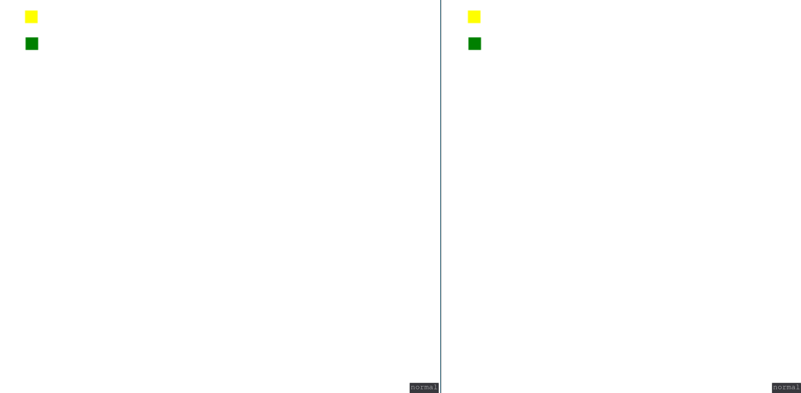

# i8m

This is a small multiplayer demo written in Go.
To run, go to the `server` directory and execute
`go run main.go`. Point your web browser to `localhost:8080`.
Use the arrow keys to move.

Below is a demo of two local browser windows both
connected to the server. First I move the first player,
then the second one.

